# Technical Documentation

Reference for the bots, scripts, and data formats powering this repo.

## Most common tasks

| I want to... | Do this |
|---|---|
| Propose a new heuristic | Edit `the-algorithm.ts`, run it locally, open PR with `iteration` label |
| Update docs/logs/scripts | Open a normal PR without `iteration` label |
| Rebuild iteration index | `npm run build:iterations` |
| Refresh README iteration table | `npm run sync:readme` |
| Refresh full iterations log | `npm run sync:iterations-log` |
| Refresh all generated iteration docs | `npm run docs:sync` |
| Run Alexandra D1–D8 three-model jury | `npm run alexandra-eval` → `npm run alexandra-aggregate` (needs `OPENROUTER_API_KEY`, `cache/sites.sqlite`, enriched dossiers) |
| Claude-only top-N rationales (per D1–D8) | `npm run alexandra-top10-justify` after aggregate exists → `cache/alexandra-top10-justifications.json` (set **`ANTHROPIC_API_KEY`** for BYOK, or **`OPENROUTER_API_KEY`**) |
| Rank candidates with Alexandra aggregates | `SCORING_MODE=v9 npx tsx the-algorithm.ts` (reads `cache/alexandra-aggregate.json`) |

Rubric: [alexandra-rubric.md](../evaluation/alexandra-rubric.md). Iteration notes: [v9 README](../../iterations/v9/README.md).

Contributor-first guide: [CONTRIBUTING.md](../../CONTRIBUTING.md)

**Heuristic suggestions:** Non-code contributors can open a [Heuristic suggestion](https://github.com/nwspk/politech-awards-2026/issues/new?template=heuristic-suggestion.md) issue (same fields as the PR template) and tag @sugaroverflow for implementation support.

---

## Bots at a glance

| Bot | When it runs | What it does |
|-----|--------------|--------------|
| **Iteration Details Updater** | PR has `iteration` label + "Ready for review", or `run-bot` label | Creates/updates `iterations/{version}/README.md` from your committed `results.json` (no algorithm run) |
| **Voting Bot** | PR has `iteration` label + "Ready for review", or `start-vote` label | Posts voting comment, tracks 👍/👎, resolves at 48h |
| **Post-Merge Finalization** | PR merged to main | Updates `pr_status` -> merged, snapshots `iterations/{version}/results.json` from merged `results.json` |

**Iteration PRs only:** Bots run only when the PR has the `iteration` label. Data collection, docs, and other PRs skip the bots — add `iteration` only when proposing a new scoring heuristic. (Create the label in repo Settings -> Labels if it doesn't exist.)

**Manual triggers:** `run-bot` — re-run iteration details updater. `start-vote` — re-start voting.

**Setup:** Create the `iteration` label in repo settings (Issues -> Labels) if it doesn't exist. Suggested color: `#0E8A16` (green).

### Flow diagram

```mermaid
flowchart TB
    subgraph AUTHOR["Author (before PR)"]
        A0[Run algorithm locally] --> A0b[Commit results.json + cache]
    end

    subgraph PR_OPEN["PR with iteration label"]
        A1[Bot reads committed results.json] --> A2[Create iterations/vN/README.md from PR body]
        A2 --> A3[build-iterations -> iterations.json]
        A3 --> A4[Snapshot iterations/vN/results.json]
        A4 --> A5[sync-readme -> README summary table]
        A5 --> A5b[sync-iterations-log -> docs/logs/iterations-log.md]
        A5b --> A6[Commit & push]
    end

    subgraph PR_MERGE["PR merged to main"]
        B1[Use merged results.json] --> B2[Snapshot iterations/vN/results.json]
        B2 --> B3[Update iterations/vN/README.md: pr_status, top_project]
        B3 --> B4[build-iterations -> iterations.json]
        B4 --> B5[sync-readme -> README summary table]
        B5 --> B5b[sync-iterations-log -> docs/logs/iterations-log.md]
        B5b --> B6[Commit & push]
    end

    subgraph SOURCE_OF_TRUTH["Source of truth"]
        MD[iterations/*/README.md]
        MD --> JSON[iterations.json]
        JSON --> README[README Iterations section]
    end
```

| When | Creates | Updates |
|------|---------|---------|
| **PR opened** (with `results.json`) | `iterations/vN/README.md`, `iterations/vN/results.json` | `iterations.json`, README |
| **PR merged** | — | `iterations/vN/README.md`, `iterations/vN/results.json`, `iterations.json`, README |

---

## Iteration Details Updater

[`../../.github/workflows/iteration-details-updater.yml`](../../.github/workflows/iteration-details-updater.yml) + [`../../scripts/bots/iteration-details-updater.ts`](../../scripts/bots/iteration-details-updater.ts)

**Triggers:** PR has `iteration` label and is "Ready for review", or `run-bot` label. Does not run on drafts. Non-iteration PRs (data, docs, fixes) skip the updater.

**Author-provided results:** The bot does not run the algorithm. You run it locally and commit `results.json`. The bot reads your results and creates the iteration. For **v9 (Alexandra)**, generate `results.json` with **`SCORING_MODE=v9 npx tsx the-algorithm.ts`** so scores come from `cache/alexandra-aggregate.json`; the default command uses **v5 ITN/A** and will not match v9. If your PR title starts with **`vN:`** and `iterations/vN/README.md` already exists with no conflicting `pr_number`, the bot assigns **vN** instead of auto-incrementing.

**What it does:**

1. Checks for `results.json` in the PR branch — if missing, posts "Results Required" and exits
2. Parses `## Title`, `## Heuristic`, `## Rationale`, `## Limitations`, `## Assessment` from the PR
3. Determines version (re-run: finds existing `iterations/{version}/README.md` by `pr_number`; new: next version from existing folders)
4. Writes or updates `iterations/{version}/README.md` — single source of truth
5. Runs `build-iterations` to regenerate `iterations.json`
6. Runs `sync-readme` to regenerate the compact Iterations summary table in README
7. Runs `sync-iterations-log` to regenerate full records in `docs/logs/iterations-log.md`
8. Snapshots `iterations/{version}/results.json` from your committed `results.json`
9. Commits and pushes `iterations/`, `iterations.json`, README, and iterations log
10. Posts a comment with top 5, middle 5, bottom 5 from your results

**Re-runs:** Add `run-bot` to update the existing entry instead of creating a duplicate.

**Fork PRs:** The bot runs and posts results but cannot push to your fork. Pull from upstream or re-run locally.

---

## Voting Bot

[`../../.github/workflows/pr-voting.yml`](../../.github/workflows/pr-voting.yml) + [`../../scripts/bots/voting-bot.ts`](../../scripts/bots/voting-bot.ts)

**Triggers:** PR has `iteration` label and is "Ready for review", or `start-vote` label. Non-iteration PRs skip the voting flow.

**Flow:** Notify (48h deadline) -> Tally (on each comment) -> Remind (24h) -> Resolve (48h). Majority of those who vote wins. React 👍 = YES, 👎 = NO. Abstentions don't count.

**Run manually:**
- `npx tsx scripts/bots/voting-bot.ts notify <issue_number>`
- `npx tsx scripts/bots/voting-bot.ts tally <issue_number>`
- `npx tsx scripts/bots/voting-bot.ts deadline`

---

## Post-Merge Finalization

[`../../.github/workflows/on-merge.yml`](../../.github/workflows/on-merge.yml) + [`../../scripts/bots/finalize-merge.ts`](../../scripts/bots/finalize-merge.ts)

**Triggers:** Automatically when a PR is merged to main.

**What it does:** Uses the merged `results.json` (no algorithm run). Updates `iterations/{version}/README.md` (`pr_status` -> merged, `top_project` from results), snapshots `iterations/{version}/results.json`, regenerates `iterations.json`, README summary table, and `docs/logs/iterations-log.md`. Runs in the background; no action needed.

---

## Labels

| Label | Meaning |
|-------|---------|
| `iteration` | **Opt-in:** PR proposes a new heuristic — bots run only when this label is present. Add when ready for algorithm run + committee vote. |
| `vote:pending` | Voting open |
| `vote:approved` | Majority yes |
| `vote:rejected` | Majority no |
| `vote:deadline-passed` | 48h elapsed |
| `ready-to-merge` | Approved — merge when ready |
| `run-bot` | Manual: re-run iteration details updater |
| `start-vote` | Manual: re-start voting |

**Setup:** Create the `iteration` label in repo settings (Issues -> Labels) if it doesn't exist. Suggested color: `0E8A16` (green).

---

## iterations/ Directory

Each iteration has a folder `iterations/vN/` containing:

- **`README.md`** — Single source of truth for that iteration (frontmatter + ## Heuristic, ## Rationale, ## Data sources, ## Limitations, ## Assessment). GitHub shows it when you open the folder.
- **`results.json`** — Ranked shortlist snapshot for that run. Iterations with extra artifacts (e.g. v5's deliberation outputs) keep them in the same folder.

The iteration details updater creates the folder and writes `README.md` and `results.json`; post-merge updates `pr_status` and `top_project` in `README.md`. **`iterations.json` is generated from the README files** — never edit it directly. After editing a README, run `npm run build:iterations`.

---

## results/ Directory

- **`results.json`** (repo root) — Current run; overwritten each time the algorithm runs. Versioned snapshots live in `iterations/vN/results.json`, not in `results/`.

---

## Scripts

Use [scripts/README.md](../../scripts/README.md) for the full script catalog.

Most used commands:

- `npm run build:iterations` - rebuild `iterations.json`
- `npm run sync:readme` - refresh README iteration table
- `npm run sync:iterations-log` - refresh canonical iterations log
- `npm run docs:sync` - run all iteration/doc sync steps
- `npm run cache:sites` - cache candidate pages
- `npm run cache:sites:retry` - retry failed cache fetches
- `npm run cache:read -- <url> [port]` - inspect cached page in browser

---

## iterations.json Schema

Generated by `build-iterations`. Do not edit manually.

| Field | Type | Description |
|-------|------|-------------|
| `version` | string | e.g. `"v3"` |
| `title` | string \| null | Display name |
| `date` | string \| null | YYYY-MM-DD |
| `author` | string \| null | GitHub handle (e.g. @username) |
| `pr_number` | number \| null | PR number |
| `pr_url` | string \| null | Full PR URL |
| `pr_status` | string \| null | `"open"`, `"merged"`, `"rejected"` |
| `top_project` | object | `{ name, url, score }` |
| `heuristic` | string | From `## Heuristic` |
| `rationale` | string \| null | From `## Rationale` |
| `data_sources` | string[] \| null | Auto-detected from code |
| `keywords` | string[] \| null | From frontmatter |
| `limitations` | string \| null | From `## Limitations` |
| `assessment` | string \| null | From `## Assessment` |
| `vote_result` | string \| null | Committee outcome |
