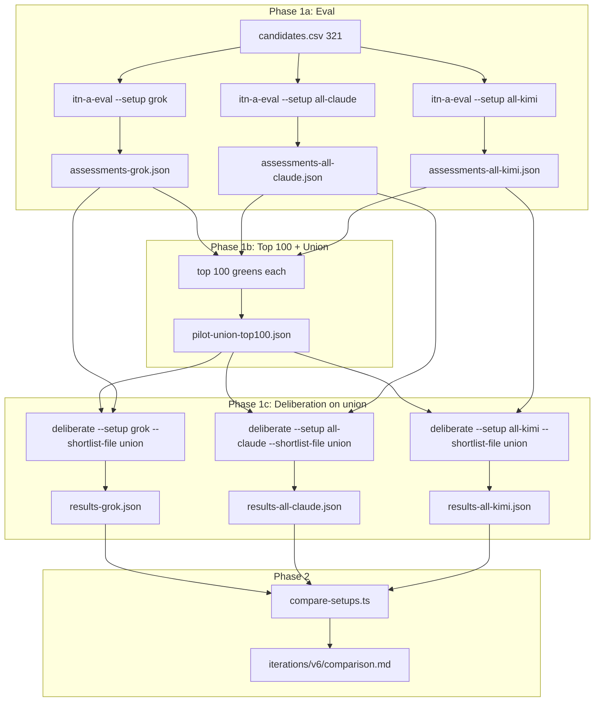

# v6 pipeline: 3-setup pilot (Grok, Claude, Kimi)

Run full eval per model, each model's top 100 by greens, union that set, then use the union as the deliberation pool. Compare winners / top-10 / rank deltas; promote best to full 321 run.

---

## Phase 1 — Full eval, top 100 greens, union, deliberation on union

### Agent structure (same as v5)

- **3 agents per model:** political, relational, experimental. Each agent gives **one bucket** per project: green, yellow, red, or grey. So each project has 3 bucket values per model. No change to this guideline.

### 1.1 Eval (all three models, no reuse)

- Run **full eval on all 321** for each model (Grok, Claude, Kimi). Do **not** reuse v5 Grok assessments — run Grok eval again so we can note whether it matches v5 or not.
- Outputs: `cache/assessments-grok.json`, `cache/assessments-all-claude.json`, `cache/assessments-all-kimi.json`.

### 1.2 Top 100 greens per model

- From each model's assessments, take **top 100 by greens**: rank projects by green count (3 > 2 > 1 > 0); within same count, tie-break e.g. by number of yellows or arbitrarily; take first 100 URLs.
- Optional note: compare Grok's top 100 (and 2-green/3-green sets) to v5's to see if the re-run matches.

### 1.3 Union

- **Union** = all unique URLs that appear in **any** of the three top-100 lists. This is the deliberation pool (~150–250 projects).

### 1.4 Deliberation using the union

- **Shortlist rule: at least 2 greens** (not v5's 3).
- **Use the union for the deliberation arguments**: for each model, the deliberation shortlist = projects that are **in the union** and have **≥2 greens** in that model's assessments. Run the existing deliberation (scoring, argument, winner) on that shortlist, using that model's assessments and that model for all agents.
- So we run three deliberations:
  - Grok: shortlist = {url in union : ≥2 greens in assessments-grok.json}; deliberate with Grok.
  - Claude: shortlist = {url in union : ≥2 greens in assessments-all-claude.json}; deliberate with Claude.
  - Kimi: shortlist = {url in union : ≥2 greens in assessments-all-kimi.json}; deliberate with Kimi.
- The deliberation script already supports `--min-greens 2`; we use that (and the union filter via `--shortlist-file`).
- Outputs: `cache/deliberation-grok.json`, `cache/deliberation-all-claude.json`, `cache/deliberation-all-kimi.json`.
- Run the algorithm with path overrides for each → `results-grok.json`, `results-all-claude.json`, `results-all-kimi.json` (each scoring all 321 from that model's assessments + deliberation).

### 1.5 Script changes

- **itn-a-eval.ts:** `--setup NAME` → write `cache/assessments-{NAME}.json`. No project subset; always full 321.
- **itn-a-deliberate.ts:** `--setup NAME` → read `cache/assessments-{NAME}.json`, write `cache/deliberation-{NAME}.json`. Use **`--min-greens 2`** so shortlist = projects with ≥2 greens. Add **`--shortlist-file path`**: when provided, shortlist = projects that are in this URL set **and** have ≥2 greens in the assessments. So we build the union (top-100 from each model, unioned), save to e.g. `cache/pilot-union-top100.json`, then run deliberate with `--setup grok --shortlist-file cache/pilot-union-top100.json --min-greens 2` (and same for Claude, Kimi).
- **the-algorithm.ts:** Optional env/CLI overrides: `ASSESSMENTS_PATH`, `DELIBERATION_PATH`, `RESULTS_PATH`.
- **Helper script:** e.g. `scripts/top-100-greens-from-assessments.ts < assessments.json` → outputs 100 URLs (top 100 by green count). Second mode or script: given three assessment paths, output top 100 from each and write the union to `cache/pilot-union-top100.json`.

### 1.6 Run order

```bash
# 1) Full eval for each model
npx tsx scripts/itn-a-eval.ts --setup grok --model x-ai/grok-4.1-fast
npx tsx scripts/itn-a-eval.ts --setup all-claude --model anthropic/claude-sonnet-4
npx tsx scripts/itn-a-eval.ts --setup all-kimi --model moonshotai/kimi-latest

# 2) Top 100 greens from each; union → cache/pilot-union-top100.json
# (helper script)

# 3) Deliberation per model, shortlist = union ∩ ≥2-greens for that model
npx tsx scripts/itn-a-deliberate.ts --setup grok --shortlist-file cache/pilot-union-top100.json --min-greens 2 --model x-ai/grok-4.1-fast
npx tsx scripts/itn-a-deliberate.ts --setup all-claude --shortlist-file cache/pilot-union-top100.json --min-greens 2 --model anthropic/claude-sonnet-4
npx tsx scripts/itn-a-deliberate.ts --setup all-kimi --shortlist-file cache/pilot-union-top100.json --min-greens 2 --model moonshotai/kimi-latest

# 4) Algorithm with path overrides for each → results-grok.json, results-all-claude.json, results-all-kimi.json
```

Store under `iterations/v6/`: the three results files, `pilot-union-top100.json`, and optionally comparison output.

### 1.7 Implemented (ready to run)

- **itn-a-eval.ts:** `--setup NAME` writes to `cache/assessments-{NAME}.json`.
- **itn-a-deliberate.ts:** `--setup NAME` reads `cache/assessments-{NAME}.json`, writes `cache/deliberation-{NAME}.json`; `--shortlist-file path` restricts shortlist to union ∩ ≥min-greens; `--min-greens 2` is supported.
- **the-algorithm.ts:** Env overrides `ASSESSMENTS_PATH`, `DELIBERATION_PATH`, `RESULTS_PATH`.
- **scripts/top-100-greens-from-assessments.ts:** Single file: `npx tsx scripts/top-100-greens-from-assessments.ts cache/assessments-grok.json [--limit 100]`. Union: `npx tsx scripts/top-100-greens-from-assessments.ts --union cache/assessments-grok.json cache/assessments-all-claude.json cache/assessments-all-kimi.json --out cache/pilot-union-top100.json`.

---

## Phase 2 — Compare setups

- **Comparison script** (e.g. `scripts/compare-setups.ts`): inputs = paths to the three results files. Outputs: winner per setup; top-10 overlap (pairwise and/or three-way); projects with largest rank deltas across setups. Write to `iterations/v6/comparison.md`. Optionally restrict rank-delta analysis to projects in the union.

---

## Phase 3 — Promote best to full 321 run

- Human picks best setup from Phase 2. Full eval (all 321) + deliberation (shortlist = **≥2 greens** from that model, no union filter) with that model; run algorithm → `results.json`. Commit and snapshot under `iterations/v6/` as per iteration workflow.

---

## Data flow


