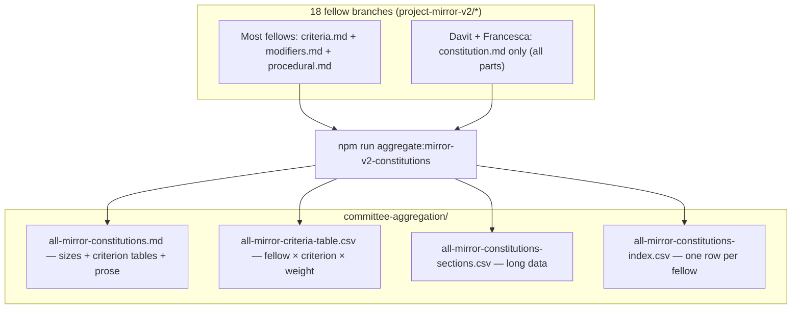

## Project Mirror v2 — aggregate constitutions for review

### Visual overview

This PR adds a **single place** to read every fellow’s evaluative rubric (Part A criteria, Part B modifiers, Part C procedural), plus **CSV exports** for analysis in Sheets, R, or pandas.

**Literal criterion catalogue:** In [`all-mirror-constitutions.md`](https://github.com/nwspk/politech-awards-2026/blob/project-mirror-v2/aggregate-constitutions-review/iterations/project-mirror-v2/committee-aggregation/all-mirror-constitutions.md), see **“Catalogue — Part A criteria”** — one **master table** (fellow, PR, #, criterion name, weight) and **one table per fellow** with the same columns. Flat copy: [`all-mirror-criteria-table.csv`](https://github.com/nwspk/politech-awards-2026/blob/project-mirror-v2/aggregate-constitutions-review/iterations/project-mirror-v2/committee-aggregation/all-mirror-criteria-table.csv).

### Files

- **`all-mirror-constitutions.md`** — Data tables (sizes by section), **criterion name + weight tables** (all fellows + per fellow), then full narrative text. Davit and Francesca use one combined `constitution.md` on their branches; everyone else uses split files when present.
- **`all-mirror-criteria-table.csv`** — One row per Part A criterion (parsed from `criteria.md` or `## Part A` in `constitution.md`): fellow, PR, index, title, weight.
- **`all-mirror-constitutions-sections.csv`** — Long format: `slug`, `section` (`part_a` | `part_b` | `part_c` | `full_constitution`), `source_file`, `content`. UTF-8 with BOM for Excel.
- **`all-mirror-constitutions-index.csv`** — One row per fellow: PR link, `layout`, character counts per part (handy for filtering without loading full text).
- **`rubrics-stacked.svg`** — Generated bar chart (optional visual for relative rubric size).
- **`scripts/bots/aggregate-mirror-v2-criteria.ts`** — Regenerates outputs; **`npm run aggregate:mirror-v2-constitutions`** from repo root (needs local `project-mirror-v2/*` refs — `git fetch origin` if missing).

The synthetic Emily input remains **rankings only** in-repo; there is no constitution text to include.

### After fellow PRs change

Re-run the npm script and commit updated artifacts (or run in CI later if you add it).
