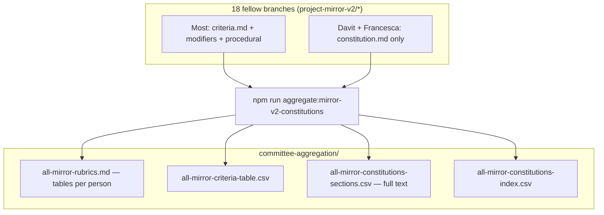

## Project Mirror v2 — rubrics in one place

### What you get

**[`all-mirror-rubrics.md`](https://github.com/nwspk/politech-awards-2026/blob/project-mirror-v2/aggregate-constitutions-review/iterations/project-mirror-v2/committee-aggregation/all-mirror-rubrics.md)** — a short markdown file: for **each fellow**, a `##` section and a **table** with columns **# | Criterion | Weight** (Part A only). No wall of prose in that file.

Supporting files (same folder): criterion rows as CSV, full rubric text as CSV sections, per-fellow size index.

### How it’s built

### Files

- **`all-mirror-rubrics.md`** — Readable **markdown tables** of Part A criteria per person.
- **`all-mirror-criteria-table.csv`** — Flat copy of those tables.
- **`all-mirror-constitutions-sections.csv`** — Long format with full markdown bodies per section.
- **`all-mirror-constitutions-index.csv`** — One row per fellow (sizes / layout).
- **`scripts/bots/aggregate-mirror-v2-criteria.ts`** — Regenerator; needs local mirror branches (`git fetch origin`).

The synthetic Emily input is rankings-only in-repo — no constitution text.

### After fellow PRs change

Re-run `npm run aggregate:mirror-v2-constitutions` and commit updated outputs.
