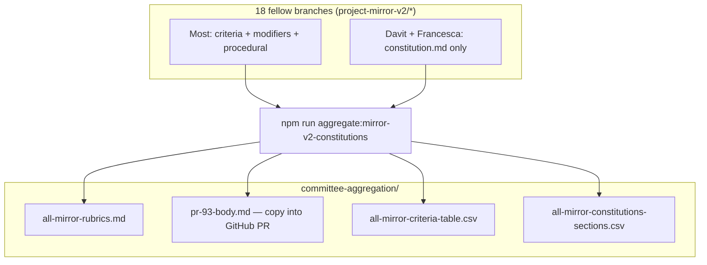

## Project Mirror v2 — aggregate rubrics for review

**Generated:** 2026-03-29

Readable per-fellow + comparison tables live in [**all-mirror-rubrics.md**](https://github.com/nwspk/politech-awards-2026/blob/project-mirror-v2/aggregate-constitutions-review/iterations/project-mirror-v2/committee-aggregation/all-mirror-rubrics.md) (same content as below, without PR length limits).

This description is **auto-generated** — run `npm run aggregate:mirror-v2-constitutions` and paste or `gh pr edit --body-file iterations/project-mirror-v2/committee-aggregation/pr-93-body.md`.

### Pipeline

## Cross-fellow comparison

_Overlap scores use **Jaccard similarity** on word tokens (length ≥ 4) from Part A criterion titles + Part B modifier titles only — a rough signal, not semantic equivalence._

### Rubric shape

| Fellow | Part A (n) | Part B (n) | Part C rules (n) | Source layout |
| --- | --- | --- | --- | --- |
| Aadi Kulkarni | 7 | 6 | 8 | split A/B/C files |
| Alessandro Pedori | 7 | 7 | 4 | split A/B/C files |
| Alexandra Ciocanel | 6 | 6 | 0 | split A/B/C files |
| Asil Sidahmed | 7 | 6 | 1 | split A/B/C files |
| Chris Owen | 7 | 6 | 8 | split A/B/C files |
| Connor Dunlop | 7 | 6 | 0 | split A/B/C files |
| David Powell | 7 | 6 | 0 | split A/B/C files |
| Davit Jintcharadze | 7 | 6 | 0 | single `constitution.md` |
| Fatima Sarah Khalid | 7 | 6 | 8 | split A/B/C files |
| Francesca Galli | 7 | 6 | 0 | single `constitution.md` |
| Frederick O'Brien | 6 | 6 | 0 | split A/B/C files |
| Gamithra Marga | 7 | 6 | 0 | split A/B/C files |
| Hannah O'Rourke | 7 | 6 | 9 | split A/B/C files |
| Huda Abdirahim | 7 | 6 | 2 | split A/B/C files |
| Jamie Coombes | 7 | 6 | 9 | split A/B/C files |
| Martina Orlea | 6 | 6 | 0 | split A/B/C files |
| Nicholas Botti | 7 | 6 | 6 | split A/B/C files |
| Tuna Acisu | 8 | 7 | 8 | split A/B/C files |

### Modifier directions (Part B)

| Fellow | boost | reduce | conditional | other |
| --- | --- | --- | --- | --- |
| Aadi Kulkarni | 3 | 2 | 1 | 0 |
| Alessandro Pedori | 3 | 3 | 1 | 0 |
| Alexandra Ciocanel | 3 | 3 | 0 | 0 |
| Asil Sidahmed | 3 | 2 | 1 | 0 |
| Chris Owen | 3 | 2 | 1 | 0 |
| Connor Dunlop | 4 | 2 | 0 | 0 |
| David Powell | 3 | 3 | 0 | 0 |
| Davit Jintcharadze | 3 | 2 | 1 | 0 |
| Fatima Sarah Khalid | 3 | 2 | 1 | 0 |
| Francesca Galli | 4 | 2 | 0 | 0 |
| Frederick O'Brien | 3 | 2 | 1 | 0 |
| Gamithra Marga | 4 | 2 | 0 | 0 |
| Hannah O'Rourke | 3 | 3 | 0 | 0 |
| Huda Abdirahim | 3 | 2 | 1 | 0 |
| Jamie Coombes | 3 | 2 | 1 | 0 |
| Martina Orlea | 5 | 1 | 0 | 0 |
| Nicholas Botti | 3 | 2 | 1 | 0 |
| Tuna Acisu | 4 | 2 | 1 | 0 |

### Theme signals in titles (Part A + B)

How many fellows have **each theme substring** anywhere in criterion or modifier titles (case-insensitive).

| Theme | Fellows (count) | Who (first names) |
| --- | --- | --- |
| governance | 13 | Aadi, Alexandra, Asil, Connor, David, Fatima, Frederick, Gamithra +5 |
| community | 14 | Aadi, Alessandro, Alexandra, Asil, Connor, Fatima, Francesca, Frederick +6 |
| democracy | 1 | Francesca |
| participation | 6 | Alessandro, Chris, Francesca, Frederick, Gamithra, Hannah |
| equity | 2 | Asil, Francesca |
| access | 12 | Aadi, Asil, Chris, David, Davit, Fatima, Francesca, Frederick +4 |
| transparency | 7 | David, Francesca, Frederick, Gamithra, Hannah, Huda, Tuna |
| privacy | 3 | Alessandro, Gamithra, Martina |
| government | 4 | Aadi, David, Fatima, Gamithra |
| institution | 6 | Asil, Connor, Davit, Frederick, Hannah, Nicholas |
| deliberative | 1 | Connor |
| inclusion | 0 | — |
| deployment | 8 | Chris, Connor, Davit, Fatima, Hannah, Huda, Jamie, Tuna |
| open source | 3 | David, Fatima, Martina |
| accountability | 8 | Aadi, Alexandra, Asil, Francesca, Hannah, Huda, Nicholas, Tuna |
| surveillance | 9 | Alexandra, Asil, Davit, Fatima, Frederick, Gamithra, Huda, Jamie +1 |
| enforcement | 1 | Connor |
| verification | 1 | Connor |

### Most similar rubric wording (Jaccard on title tokens)

| Fellow A | Fellow B | Jaccard |
| --- | --- | --- |
| Fatima Sarah Khalid | Huda Abdirahim | 0.247 |
| Aadi Kulkarni | Fatima Sarah Khalid | 0.214 |
| Aadi Kulkarni | Tuna Acisu | 0.209 |
| Fatima Sarah Khalid | Nicholas Botti | 0.209 |
| Fatima Sarah Khalid | Tuna Acisu | 0.2 |
| Nicholas Botti | Tuna Acisu | 0.195 |
| Frederick O'Brien | Huda Abdirahim | 0.184 |
| Fatima Sarah Khalid | Frederick O'Brien | 0.179 |
| Fatima Sarah Khalid | Hannah O'Rourke | 0.178 |
| Aadi Kulkarni | Nicholas Botti | 0.175 |

### Least similar pairs (still some token overlap)

| Fellow A | Fellow B | Jaccard |
| --- | --- | --- |
| Alexandra Ciocanel | Martina Orlea | 0.019 |
| Alessandro Pedori | Hannah O'Rourke | 0.02 |
| Davit Jintcharadze | Martina Orlea | 0.024 |
| Francesca Galli | Martina Orlea | 0.032 |
| Alessandro Pedori | David Powell | 0.037 |
| Alessandro Pedori | Martina Orlea | 0.038 |
| Alessandro Pedori | Connor Dunlop | 0.042 |
| Alessandro Pedori | Tuna Acisu | 0.046 |

---

<strong>Master table — Part A (all fellows)</strong>

| Fellow | # | Criterion | Weight |
| --- | --- | --- | --- |
| Aadi Kulkarni | 1 | Accessibility for excluded or underserved populations | HIGH |
| Aadi Kulkarni | 2 | Government digital infrastructure quality and interoperability | HIGH |
| Aadi Kulkarni | 3 | Regulatory and policy clarity contribution | HIGH** |
| Aadi Kulkarni | 4 | Data ethics and epistemic integrity | MEDIUM |
| Aadi Kulkarni | 5 | Implementation maturity and evidence of use | MEDIUM |
| Aadi Kulkarni | 6 | Open standards and public knowledge orientation | MEDIUM |
| Aadi Kulkarni | 7 | Cross-jurisdictional applicability | LOW |
| Alessandro Pedori | 1 | Voice / participation architecture | HIGH confidence \| 20 points max |
| Alessandro Pedori | 2 | Human adoption / facilitation design | HIGH confidence \| 18 points max |
| Alessandro Pedori | 3 | Privacy-by-design / consent architecture | HIGH confidence \| 16 points max |
| Alessandro Pedori | 4 | Theory of change depth | MEDIUM confidence \| 14 points max |
| Alessandro Pedori | 5 | Peer learning / community emergence | MEDIUM confidence \| 14 points max |
| Alessandro Pedori | 6 | Implementation maturity | MEDIUM confidence \| 12 points max |
| Alessandro Pedori | 7 | Structural interventions over informational ones | LOW confidence \| 8 points max |
| Alexandra Ciocanel | 1 | Accountability infrastructure for algorithmic and automated systems | HIGH (max 20 pts) |
| Alexandra Ciocanel | 2 | Centring populations excluded by algorithmic or bureaucratic categorical systems | HIGH (max 20 pts) |
| Alexandra Ciocanel | 3 | Qualitative or ethnographic grounding — does the project know how its users actually live? | MEDIUM (max 12 pts) |
| Alexandra Ciocanel | 4 | Critical self-examination of power claims — does the project know what it is actually doing? | MEDIUM (max 12 pts) |
| Alexandra Ciocanel | 5 | Human-centred design practice in public service contexts | MEDIUM (max 12 pts) |
| Alexandra Ciocanel | 6 | Implementation maturity — is this real, working, and reaching people? | LOW (max 6 pts) |
| Asil Sidahmed | 1 | Health equity and access impact | high (25 pts) |
| Asil Sidahmed | 2 | Decolonial governance and power redistribution | high (20 pts) |
| Asil Sidahmed | 3 | Patient/community-centred design | high (20 pts) |
| Asil Sidahmed | 4 | Ethical infrastructure and accountability | medium (15 pts) |
| Asil Sidahmed | 5 | Conflict/fragile-state applicability | medium (10 pts) |
| Asil Sidahmed | 6 | Movement-building and collective action infrastructure | medium (5 pts) |
| Asil Sidahmed | 7 | Epistemic humility and self-criticality | low (5 pts) |
| Chris Owen | 1 | Empowerment of excluded/marginalised communities | 20 points (HIGH) |
| Chris Owen | 2 | Education and capability-building as core mechanism | 18 points (HIGH) |
| Chris Owen | 3 | Volunteer-driven, low-cost, resource-efficient models | 15 points (HIGH) |
| Chris Owen | 4 | Open-source code and replicable educational materials | 15 points (MEDIUM-HIGH) |
| Chris Owen | 5 | Practical deployment with real users | 14 points (MEDIUM) |
| Chris Owen | 6 | Political technology connecting to civic participation | 10 points (MEDIUM-LOW) |
| Chris Owen | 7 | Scalability and cross-context replicability | 8 points (LOW) |
| Connor Dunlop | 1 | Enforcement and verification infrastructure | 20 |
| Connor Dunlop | 2 | Participatory and deliberative governance | 20 |
| Connor Dunlop | 3 | Supply chain and lifecycle governance | 20 |
| Connor Dunlop | 4 | Institutional and democratic infrastructure | 12 |
| Connor Dunlop | 5 | International and cross-jurisdictional applicability | 12 |
| Connor Dunlop | 6 | Evidence quality and research rigour | 12 |
| Connor Dunlop | 7 | Compute governance and technical infrastructure | 6 |
| David Powell | 1 | Organisational structure and governance | 20 |
| David Powell | 2 | User-centred design for underserved populations | 20 |
| David Powell | 3 | Real-world adoption and use | 18 |
| David Powell | 4 | Genuine open source and open data | 14 |
| David Powell | 5 | Collaborative and cooperative technology | 12 |
| David Powell | 6 | Public health and government digital infrastructure | 10 |
| David Powell | 7 | Environmental sustainability | 6 |
| Davit Jintcharadze | 1 | Democratic resilience utility | 20 pts (high) |
| Davit Jintcharadze | 2 | Inclusivity of non-Western and crisis contexts | 20 pts (high) |
| Davit Jintcharadze | 3 | Psychological/behavioural depth of intervention | 12 pts (medium) |
| Davit Jintcharadze | 4 | Strategic impact clarity (theory of change) | 12 pts (medium) |
| Davit Jintcharadze | 5 | Implementation maturity and real deployment | 12 pts (medium) |
| Davit Jintcharadze | 6 | Open access and anti-capture design | 6 pts (low) |
| Davit Jintcharadze | 7 | Humanitarian and dignity-centred framing | 6 pts (low) |
| Fatima Sarah Khalid | 1 | Accessibility of civic and political technology for excluded communities | HIGH (max 20 pts) |
| Fatima Sarah Khalid | 2 | Open source commitment and community governance | HIGH (max 20 pts) |
| Fatima Sarah Khalid | 3 | Making government and civic processes legible and navigable | HIGH (max 20 pts) |
| Fatima Sarah Khalid | 4 | Inclusive community-building as a dimension of the project's design | MEDIUM (max 12 pts) |
| Fatima Sarah Khalid | 5 | Implementation maturity and real-world deployment | MEDIUM (max 12 pts) |
| Fatima Sarah Khalid | 6 | AI and technology as community infrastructure, not surveillance infrastructure | MEDIUM (max 12 pts) |
| Fatima Sarah Khalid | 7 | Cross-jurisdictional replicability and knowledge sharing | LOW (max 6 pts) |
| Francesca Galli | 1 | Digital commons protection and anti-extractivism | HIGH — 20 points |
| Francesca Galli | 2 | Civic engagement and participatory democracy enablement | HIGH — 20 points |
| Francesca Galli | 3 | Data for social good — rigour applied to public benefit | HIGH — 20 points |
| Francesca Galli | 4 | Social cohesion, belonging, and equity of access | MEDIUM — 12 points |
| Francesca Galli | 5 | Interdisciplinary approach and creative methodology | MEDIUM — 12 points |
| Francesca Galli | 6 | Transparency, accountability, and epistemic honesty | MEDIUM — 12 points |
| Francesca Galli | 7 | Community ownership and local grounding | LOW — 6 points |
| Frederick O'Brien | 1 | Free and open access to tools — removal of access barriers | high (max 20 pts) |
| Frederick O'Brien | 2 | Direct benefit to practitioners and communities — not organisations or platforms | high (max 20 pts) |
| Frederick O'Brien | 3 | Anti-extraction stance — independence from corporate platforms and surveillance infrastructure | high (max 20 pts) |
| Frederick O'Brien | 4 | Community journalism and democratic participation infrastructure | medium (max 12 pts) |
| Frederick O'Brien | 5 | Technology in service of human skill — tools that augment, not replace | medium (max 12 pts) |
| Frederick O'Brien | 6 | Design ethics and intentionality — craft as a political choice | low (max 6 pts) |
| Gamithra Marga | 1 | Community Ownership and Governance Model | HIGH (20 points) |
| Gamithra Marga | 2 | Technological Sovereignty / Self-Hosting Capability | HIGH (20 points) |
| Gamithra Marga | 3 | Anti-Extraction Innovation Design | HIGH (20 points) |
| Gamithra Marga | 4 | Privacy by Design and Data Ethics | MEDIUM (12 points) |
| Gamithra Marga | 5 | Accessibility and Inclusive Participation | MEDIUM (12 points) |
| Gamithra Marga | 6 | Environmental Responsibility and Long-Term Thinking | MEDIUM (12 points) |
| Gamithra Marga | 7 | Open Government and Democratic Transparency | LOW (6 points) |
| Hannah O'Rourke | 1 | Democratic infrastructure quality and accessibility | HIGH (max 20 pts) |
| Hannah O'Rourke | 2 | Evidence-based design and epistemic rigour | HIGH (max 20 pts) |
| Hannah O'Rourke | 3 | Participation infrastructure for low-resource organising | HIGH (max 20 pts) |
| Hannah O'Rourke | 4 | Practical deployment and real-world uptake | MEDIUM (max 12 pts) |
| Hannah O'Rourke | 5 | Coalition-building and cross-factional utility | MEDIUM (max 12 pts) |
| Hannah O'Rourke | 6 | Transparency and trust-building in institutions | MEDIUM (max 12 pts) |
| Hannah O'Rourke | 7 | AI governance and responsible technology framing | LOW (max 6 pts) |
| Huda Abdirahim | 1 | Budget and treasury transparency as civic infrastructure | high (20 points) |
| Huda Abdirahim | 2 | Governance legibility — making power and decision-making visible | high (20 points) |
| Huda Abdirahim | 3 | Collective ownership and community governance of infrastructure | high (20 points) |
| Huda Abdirahim | 4 | Practical deployment and real-world use | medium (12 points) |
| Huda Abdirahim | 5 | Interoperability and open standards | medium (12 points) |
| Huda Abdirahim | 6 | Political infrastructure focus (not just political content) | medium (12 points) |
| Huda Abdirahim | 7 | Legitimacy and accountability — is the project itself accountable? | low (6 points) |
| Jamie Coombes | 1 | Safety-consciousness and interpretability by design | HIGH (20 pts) |
| Jamie Coombes | 2 | Public-interest deployment with real beneficiaries | HIGH (20 pts) |
| Jamie Coombes | 3 | Open infrastructure and community enablement | HIGH (20 pts) |
| Jamie Coombes | 4 | Evidence of deployment and implementation maturity | MEDIUM (12 pts) |
| Jamie Coombes | 5 | Participatory design and governance model | MEDIUM (12 pts) |
| Jamie Coombes | 6 | Systemic risk awareness and mitigation orientation | MEDIUM (12 pts) |
| Jamie Coombes | 7 | Originality and distinctiveness of approach | LOW (6 pts) |
| Martina Orlea | 1 | Campaign Infrastructure & Effectiveness | HIGH — 20 pts |
| Martina Orlea | 2 | Information Warfare & Counter-Disinformation | HIGH — 20 pts |
| Martina Orlea | 3 | Evidence-Based Decision Making | HIGH — 20 pts |
| Martina Orlea | 4 | Community Organising & Volunteer Mobilisation | MEDIUM — 12 pts |
| Martina Orlea | 5 | Privacy-Respecting & GDPR-Native Tools | MEDIUM — 12 pts |
| Martina Orlea | 6 | Cross-Context Transferability | LOW — 6 pts |
| Nicholas Botti | 1 | AI and institutional decision-making safety and alignment | HIGH (max 20 pts) |
| Nicholas Botti | 2 | Financial stability, regulatory, and institutional infrastructure quality | HIGH (max 20 pts) |
| Nicholas Botti | 3 | Complexity-aware and epistemically honest methodology | HIGH (max 20 pts) |
| Nicholas Botti | 4 | Cooperation-building and pro-social incentive design | MEDIUM (max 12 pts) |
| Nicholas Botti | 5 | Protection of attention, autonomy, and community | MEDIUM (max 12 pts) |
| Nicholas Botti | 6 | Implementation maturity and evidence of real-world institutional use | MEDIUM (max 12 pts) |
| Nicholas Botti | 7 | Cross-jurisdictional applicability and global accessibility | LOW (max 6 pts) |
| Tuna Acisu | 1 | Evidence legibility for public decision-making | HIGH |
| Tuna Acisu | 2 | Methodological transparency and reproducibility | HIGH |
| Tuna Acisu | 3 | Open data and open-source infrastructure commitment | MEDIUM |
| Tuna Acisu | 4 | Data visualisation quality and design integrity | MEDIUM |
| Tuna Acisu | 5 | Contribution to counter-narratives grounded in evidence | MEDIUM |
| Tuna Acisu | 6 | Implementation maturity and real-world deployment | LOW |
| Tuna Acisu | 7 | Global development relevance and cross-jurisdictional scope | LOW |
| Tuna Acisu | 8 | Participatory accountability and governance transparency | LOW |

<strong>Master table — Part B value modifiers (all fellows)</strong>

| Fellow | # | Modifier | Direction | Magnitude |
| --- | --- | --- | --- | --- |
| Aadi Kulkarni | 1 | Boosts projects that serve communities with no existing digital alternative | boost | strong (+10–15 pts) |
| Aadi Kulkarni | 2 | Reduces projects that centralise civic data without governance accountability | reduce | strong (−10–15 pts) |
| Aadi Kulkarni | 3 | Boosts projects that make legal or regulatory text legible to non-specialists | boost | moderate (+5–10 pts) |
| Aadi Kulkarni | 4 | Reduces purely symbolic interventions with no civic infrastructure value | reduce | moderate (−5–10 pts) |
| Aadi Kulkarni | 5 | Conditional — boosts open-source projects with active community governance, reduces closed proprietary tools claiming civic purpose | conditional | moderate (+5–10 pts boost if open; −5–8 pts reduce if proprietary with civic claims) |
| Aadi Kulkarni | 6 | Boosts projects explicitly designed to enable government to deliver services better | boost | moderate (+5–8 pts) |
| Alessandro Pedori | 1 | Voice-equalisation mechanisms (BOOST: +10 to +15) | boost (from title) | — |
| Alessandro Pedori | 2 | Adversarial / punitive approach (REDUCE: -5 to -10) | reduce (from title) | — |
| Alessandro Pedori | 3 | Privacy / consent by design (BOOST: +5 to +10) | boost (from title) | — |
| Alessandro Pedori | 4 | Peer-learning vs expert-delivery (CONDITIONAL: +5 to +10 / -5 to -8) | conditional (from title) | — |
| Alessandro Pedori | 5 | Digitises without redesigning (REDUCE: -5 to -10) | reduce (from title) | — |
| Alessandro Pedori | 6 | Emotional safety / group dynamics (BOOST: +2 to +5) | boost (from title) | — |
| Alessandro Pedori | 7 | US-centric ignoring European context (REDUCE: -2 to -5) | reduce (from title) | — |
| Alexandra Ciocanel | 1 | Boosts projects creating contestability and redress for algorithmic harm | boost | strong (+8–14 pts) |
| Alexandra Ciocanel | 2 | Reduces projects framing expanded profiling as community empowerment | reduce | strong (−10–15 pts) |
| Alexandra Ciocanel | 3 | Boosts projects serving populations excluded by specific named mechanisms | boost | moderate (+5–9 pts) |
| Alexandra Ciocanel | 4 | Reduces projects increasing surveillance or profiling capacity without governance | reduce | moderate (−6–12 pts) |
| Alexandra Ciocanel | 5 | Boosts projects with documented genuine community involvement in design | boost | moderate (+4–8 pts) |
| Alexandra Ciocanel | 6 | Reduces purely technical framings that bypass political/governance dimensions | reduce | weak (−3–7 pts) |
| Asil Sidahmed | 1 | Global South leadership boost | boost | strong (+10-15 pts) |
| Asil Sidahmed | 2 | Surveillance and extraction penalty | reduce | strong (-10-15 pts) |
| Asil Sidahmed | 3 | Fragile-context resilience boost | boost | moderate (+5-10 pts) |
| Asil Sidahmed | 4 | Paternalism and rescue-framing penalty | reduce | moderate (-5-10 pts) |
| Asil Sidahmed | 5 | Women and gender-marginalised populations boost | boost | moderate (+5-10 pts) |
| Asil Sidahmed | 6 | Institutional transformation over incremental digitisation boost | conditional (boost when transformative; no effect when merely digital) | weak (+2-5 pts) |
| Chris Owen | 1 | Boost for projects serving excluded populations | boost | strong (+10-15 pts); cap at +5 when C1 >= 18 |
| Chris Owen | 2 | Boost for volunteer/low-cost models | boost | moderate (+5-10 pts) |
| Chris Owen | 3 | Reduce for digitising existing power without expanding access | reduce | moderate (-5-10 pts) |
| Chris Owen | 4 | Boost for open, replicable educational materials | boost | moderate (+5-10 pts); cap at +3 when C3 >= 18 |
| Chris Owen | 5 | Protect early-stage projects serving excluded populations | boost (conditional) | mild (+2-5 pts) |
| Chris Owen | 6 | Reduce for tech-centric framing over people-centric framing | reduce | mild (-2-5 pts) |
| Connor Dunlop | 1 | Technical enforcement boost | boost | +8 to +14 |
| Connor Dunlop | 2 | Voluntary-only reduction | reduce | -8 to -12 |
| Connor Dunlop | 3 | Precautionary design boost | boost | +5 to +9 |
| Connor Dunlop | 4 | Community co-governance boost | boost | +4 to +8 |
| Connor Dunlop | 5 | Power concentration reduction | reduce | -10 to -15 |
| Connor Dunlop | 6 | Post-deployment monitoring boost | boost (weak) | +3 to +6 |
| David Powell | 1 | Cooperative/non-profit structure boost | boost | +6 to +12 points |
| David Powell | 2 | VC-backed/founder-enrichment penalty | reduce | −6 to −10 points |
| David Powell | 3 | Accessibility for vulnerable users boost | boost | +4 to +8 points |
| David Powell | 4 | Performative open-source penalty | reduce | −4 to −8 points |
| David Powell | 5 | Worker treatment and pay transparency boost | boost | +3 to +6 points |
| David Powell | 6 | Dead link / inactive project penalty | reduce | −15 to −20 points (cap at 45) |
| Davit Jintcharadze | 1 | Backsliding/hybrid regime deployment boost | boost | strong (+10–15 pts) |
| Davit Jintcharadze | 2 | Western civic tech assumption penalty | reduce | moderate (−5 to −10 pts) |
| Davit Jintcharadze | 3 | Strategic leverage boost | boost | moderate (+5–10 pts) |
| Davit Jintcharadze | 4 | No-alternative population boost | boost | moderate (+5–10 pts) |
| Davit Jintcharadze | 5 | Surveillance/capture penalty | reduce | strong (−10 to −15 pts) |
| Davit Jintcharadze | 6 | Grassroots vs institutional distribution (conditional) | conditional | weak (+2–5 pts boost / −2–5 pts reduce) |
| Fatima Sarah Khalid | 1 | Boost — community ownership or governance of the project itself | boost | strong (+8–14 points) |
| Fatima Sarah Khalid | 2 | Reduce — extractive data practices or surveillance without community consent | reduce | strong (−10–16 points) |
| Fatima Sarah Khalid | 3 | Boost — designed specifically for under-resourced or under-served civic contexts | boost | moderate (+5–9 points) |
| Fatima Sarah Khalid | 4 | Reduce — tools that digitise existing power structures without challenging them | reduce | moderate (−5–8 points) |
| Fatima Sarah Khalid | 5 | Boost — inclusive developer community as a visible part of the project | boost | weak (+3–6 points) |
| Fatima Sarah Khalid | 6 | Conditional — prototype protection for accessibility-first projects | conditional | moderate (+4–8 points on implementation maturity criterion only) |
| Francesca Galli | 1 | Penalise extractive/platform-captured tools: -8 to -12 pts | reduce (from title) | -8 to -12 pts |
| Francesca Galli | 2 | Boost playful/accessible civic participation: +5 to +10 pts | boost (from title) | — |
| Francesca Galli | 3 | Boost diaspora/migrant/cross-border projects: +5 to +8 pts | boost (from title) | — |
| Francesca Galli | 4 | Penalise digitising power without challenging it: -5 to -8 pts | reduce (from title) | -5 to -8 pts |
| Francesca Galli | 5 | Boost visible self-critique/epistemic honesty: +3 to +5 pts | boost (from title) | — |
| Francesca Galli | 6 | Boost European/Italian civic tech: +3 to +5 pts | boost (from title) | — |
| Frederick O'Brien | 1 | Boost — tools built for practitioners who have no existing alternatives | boost | strong (+8–12 points) |
| Frederick O'Brien | 2 | Reduce — extractive platform capture or surveillance-adjacent architecture | reduce | strong (−8–12 points) |
| Frederick O'Brien | 3 | Boost — community ownership or governance — power to practitioners not institutions | boost | moderate (+5–8 points) |
| Frederick O'Brien | 4 | Reduce — tools that automate civic judgment or replace human decision-making | reduce | moderate (−5–8 points) |
| Frederick O'Brien | 5 | Boost — equitable economics for creative and media workers | boost | moderate (+4–7 points) |
| Frederick O'Brien | 6 | Boost — epistemic humility and prototype transparency | boost (conditional — applies only when combined with genuine innovative design) | weak (+3–5 points) |
| Gamithra Marga | 1 | Ecstatic / Embodied / Joyful Technology Boost | boost | moderate (+5–10 points) |
| Gamithra Marga | 2 | Platforms-as-Infrastructure / Open Protocol Boost | boost | strong (+8–12 points) |
| Gamithra Marga | 3 | VC / Surveillance / Extraction Penalty | reduce | strong (−10–15 points) |
| Gamithra Marga | 4 | Emotional / Human Complexity Recognition Boost | boost | weak (+3–6 points) |
| Gamithra Marga | 5 | Addictive / Algorithmic Harm Penalty | reduce | moderate (−6–10 points) |
| Gamithra Marga | 6 | Small-Scale / Under-Resourced / Emerging Work Boost | boost | weak (+3–5 points) |
| Hannah O'Rourke | 1 | Boosts tools designed for low-resource informal organising contexts | boost | strong (+8 to +14 pts) |
| Hannah O'Rourke | 2 | Reduces tools that increase institutional power without accountability | reduce | strong (−8 to −14 pts) |
| Hannah O'Rourke | 3 | Boosts improvised or experimental approaches to civic problems | boost | moderate (+4 to +8 pts) |
| Hannah O'Rourke | 4 | Reduces tools that presuppose high political engagement or specialist knowledge | reduce | moderate (−4 to −8 pts) |
| Hannah O'Rourke | 5 | Boosts projects bridging across institutional or political divides | boost | moderate (+4 to +8 pts) |
| Hannah O'Rourke | 6 | Reduces tools that create tech debt or fragmentation in democratic infrastructure | reduce | moderate (−4 to −8 pts) |
| Huda Abdirahim | 1 | Boost — programmable governance and on-chain transparency | boost | strong (+8–12 points) |
| Huda Abdirahim | 2 | Boost — tools that serve those excluded from traditional financial/governance systems | boost | moderate (+5–8 points) |
| Huda Abdirahim | 3 | Boost — projects that make the relationship between code and power explicit | boost | moderate (+4–7 points) |
| Huda Abdirahim | 4 | Reduce — extractive platforms and surveillance-adjacent tools | reduce | strong (−8–12 points) |
| Huda Abdirahim | 5 | Reduce — digital governance tools that increase state power without accountability | reduce | moderate (−5–8 points) |
| Huda Abdirahim | 6 | Conditional — early-stage or prototype tools with strong theory of change | conditional boost | weak (+3–5 points) |
| Jamie Coombes | 1 | Safety-interpretability prerequisite boost | Boost | Strong (+10–15 pts) |
| Jamie Coombes | 2 | Extractive or surveillance-adjacent penalty | Reduce | Strong (−10–14 pts) |
| Jamie Coombes | 3 | Community infrastructure amplifier | Boost | Moderate (+6–10 pts) |
| Jamie Coombes | 4 | Participatory governance signal boost | Boost | Moderate (+5–8 pts) |
| Jamie Coombes | 5 | Thin-evidence prototype protection | Conditional (floor, not boost) | Moderate — sets uncertainty floor at 28 pts when applicable |
| Jamie Coombes | 6 | AI ethics rhetoric without mechanism penalty | Reduce | Weak (−4–7 pts) |
| Martina Orlea | 1 | Progressive Values Alignment | boost (from title) | +2 to +8 |
| Martina Orlea | 2 | Practitioner-Built Credibility | boost (from title) | +2 to +6 |
| Martina Orlea | 3 | Multi-Channel Strategy Support | boost (from title) | +1 to +5 |
| Martina Orlea | 4 | Bot/Automation Scepticism Penalty | reduce (from title) | -3 to -8 |
| Martina Orlea | 5 | Scalability Evidence Bonus | boost (from title) | +2 to +6 |
| Martina Orlea | 6 | Open Source / Accessibility Bonus | boost (from title) | +1 to +4 |
| Nicholas Botti | 1 | Boost — Human-in-the-loop governance and judgment preservation | boost | moderate (+6–10 points) |
| Nicholas Botti | 2 | Reduce — Surveillance, opacity, or concentration of power without accountability | reduce | moderate to strong (−8–15 points) |
| Nicholas Botti | 3 | Boost — Explicit complexity acknowledgment and failure mode documentation | boost | weak to moderate (+3–6 points) |
| Nicholas Botti | 4 | Reduce — Naive optimisation without system-level consideration | reduce | weak to moderate (−4–8 points) |
| Nicholas Botti | 5 | Boost — Economic simulation, policymaker advisory tools, or decision-support infrastructure | boost | moderate (+5–8 points) |
| Nicholas Botti | 6 | Conditional — Boosts open-source civic infrastructure; no boost for proprietary tools serving similar purposes | conditional (boost if open; no boost if proprietary) | weak (+3–5 points) if open |
| Tuna Acisu | 1 | Boosts projects with strong data visualisation that reveals hidden patterns | boost | strong (+10–15 pts) |
| Tuna Acisu | 2 | Reduces projects that operate as black boxes — opaque methodology or hidden data | reduce | strong (-10–15 pts) |
| Tuna Acisu | 3 | Boosts projects that address perception gaps between data and public belief | boost | moderate (+5–10 pts) |
| Tuna Acisu | 4 | Reduces projects that merely digitise existing power structures without adding transparency | reduce | moderate (-5–10 pts) |
| Tuna Acisu | 5 | Boosts projects serving populations whose data is underrepresented in global datasets | boost | moderate (+5–10 pts) |
| Tuna Acisu | 6 | Conditional — boosts open-source projects with active community governance; reduces "open-washing" | conditional | moderate (+5–8 pts boost if genuinely open; -5–8 pts reduce if open-washing) |
| Tuna Acisu | 7 | Boosts projects that bridge academic research and public understanding | boost | weak (+2–5 pts) |

<strong>Master table — Part C procedural rules (all fellows)</strong>

| Fellow | # | Rule | Summary |
| --- | --- | --- | --- |
| Aadi Kulkarni | 1 | Abstention threshold | A project receives N/A (abstention) only when: (a) the dossier provides insufficient evidence to assess against any of the three HIGH-wei… |
| Aadi Kulkarni | 2 | Prototype handling | Prototypes are not penalised on the implementation maturity criterion (Criterion 5) IF: the problem they address is clearly within Aadi's… |
| Aadi Kulkarni | 3 | Popularity discount | Aadi does not treat popularity as a quality signal in itself. His professional formation is in evidence-based policy and data ethics — he… |
| Aadi Kulkarni | 4 | Tie-breaking | When two projects score equally after all criteria and modifiers: first tie-breaker is accessibility for excluded populations (which proj… |
| Aadi Kulkarni | 5 | Uncertainty handling | Uncertainty lowers scores only below the underdog protection floor (if active). Above the floor, uncertainty is documented but does not m… |
| Aadi Kulkarni | 6 | Novelty vs implementation | A compelling theory of change can partially compensate for weak implementation evidence, but only if: (a) the theory is specific and the … |
| Aadi Kulkarni | 7 | Movement infrastructure vs direct service | Aadi does not systematically prioritise either over the other. His career spans both: Polici was a direct-access tool for individuals; hi… |
| Aadi Kulkarni | 8 | Scope of concern | Geographic scope does not determine base score. A project addressing local UK housing conditions or a single country's government service… |
| Alessandro Pedori | 1 | Abstention Rule | Abstain from scoring a project when: |
| Alessandro Pedori | 2 | Prototype Ceiling | Projects that are prototypes, concepts, or pre-launch (no evidence of real-world use) receive a maximum score of 8/12 on C6 (Implementati… |
| Alessandro Pedori | 3 | Underdog Protection | Projects with dossier completeness < 0.4 receive a score floor of 25 (out of 100). |
| Alessandro Pedori | 4 | Uncertainty Ceiling | When the evidence assessment marks a scoring dimension as HIGH uncertainty, the maximum score for criteria in that dimension is capped at… |
| Asil Sidahmed | 1 | Abstention threshold | A project receives N/A rather than a score when the dossier provides insufficient evidence to evaluate against at least 3 of the 7 criter… |
| Chris Owen | 1 | C.1 Abstention threshold | A project receives N/A (abstention) only when: (a) `dossier_completeness` < 0.25 with no usable description, AND (b) the project's websit… |
| Chris Owen | 2 | C.2 Dead link cap | Projects with dead links (homepage_http_status != 200 or dead_link = true) receive a score cap of 30/100. Exception: if the project has a… |
| Chris Owen | 3 | C.3 Prototype handling | Early-stage projects are not automatically penalised on C5 (practical deployment) if they serve excluded populations (C1 >= 12) and have … |
| Chris Owen | 4 | C.4 Popularity discount | Popularity is not a quality signal. When a project scores highly but its dossier richness (high completeness, extensive description) expl… |
| Chris Owen | 5 | C.5 Tie-breaking | When two projects score equally: (1) first tie-breaker: which project serves a more excluded population (C1 comparison); (2) second tie-b… |
| Chris Owen | 6 | C.6 Novelty vs implementation | A project with a strong theory of change for an underserved population but no deployment evidence receives a maximum of 65/100. This cap … |
| Chris Owen | 7 | C.7 Movement infrastructure vs direct service | No systematic preference. Both are scored on their own merits through the criteria. Direct-service education tools score through C1+C2. M… |
| Chris Owen | 8 | C.8 Scope of concern | Geographic scope does not determine base score. A project serving refugees in one city can score as highly as a global platform. However,… |
| Fatima Sarah Khalid | 1 | Abstention threshold | Abstain (score N/A) when dossier_completeness < 0.15 AND the project's name, tagline, and scraped_description together provide fewer than… |
| Fatima Sarah Khalid | 2 | Prototype handling | Prototypes receive protection from Criterion 5 (implementation maturity) penalties when Modifier M6 applies — i.e., when the project is a… |
| Fatima Sarah Khalid | 3 | Popularity discount | Popularity is not directly discounted from scores, but the `popularity_risk` field is set to HIGH for any project that: (a) has dossier_c… |
| Fatima Sarah Khalid | 4 | Tie-breaking | When two projects have equal final scores (within ±0.5 points), apply in order: |
| Fatima Sarah Khalid | 5 | Uncertainty handling | When evidence is thin but not absent (dossier_completeness 0.15–0.40), uncertainty *triggers the uncertainty floor* — the project's score… |
| Fatima Sarah Khalid | 6 | Novelty vs implementation | A compelling theory of change can compensate for weak implementation evidence, but only up to a ceiling. A project with genuinely novel a… |
| Fatima Sarah Khalid | 7 | Movement infrastructure vs direct service | Movement infrastructure and direct service are scored equally through the criteria — there is no categorical preference. However, movemen… |
| Fatima Sarah Khalid | 8 | Scope of concern | Geographic scope does not directly affect scoring. A local project solving a real access problem for a specific community scores the same… |
| Hannah O'Rourke | 1 | Evaluative Constitution — Part C: Procedural Rules | ## Evaluator: Hannah O'Rourke |
| Hannah O'Rourke | 2 | Rule: Abstention threshold | Dossier completeness below 0.15 and description too vague to score any criterion with low confidence. |
| Hannah O'Rourke | 3 | Rule: Prototype handling | Evidence of active experimentation (hackathon origin, explicit pilot methodology, documented learning cycle) but not full deployment. Dis… |
| Hannah O'Rourke | 4 | Rule: Popularity discount | Project is well-known, has extensive documentation, or is likely in model training data. |
| Hannah O'Rourke | 5 | Rule: Tie-breaking | Two or more projects within 1 point of each other after all criteria and modifiers applied. |
| Hannah O'Rourke | 6 | Rule: Uncertainty handling | Dossier completeness below 0.35 but above 0.15. |
| Hannah O'Rourke | 7 | Rule: Novelty vs implementation | Project with strong conceptual framing but no documented users or deployment. |
| Hannah O'Rourke | 8 | Rule: Movement infrastructure vs direct service | Any project that could be classified as either movement infrastructure or direct service delivery. |
| Hannah O'Rourke | 9 | Rule: Scope of concern | Any project outside UK/Western Europe. |
| Huda Abdirahim | 1 | Abstention threshold | A project receives N/A (abstention) only when: (1) the dossier has no usable description of what the project does — not a thin descriptio… |
| Huda Abdirahim | 2 | Prototype handling | Prototypes and early-stage tools are NOT penalised under Criterion 4 (practical deployment) when: (a) the dossier provides a credible tec… |
| Jamie Coombes | 1 | --- | — |
| Jamie Coombes | 2 | Abstention threshold | Abstain (score N/A) when dossier_completeness < 0.15 AND the scraped_description is empty or consists only of a project name with no subs… |
| Jamie Coombes | 3 | Prototype handling | Prototypes receive full scoring on criteria C1 (safety/interpretability), C5 (participatory design), and C6 (systemic risk), but are capp… |
| Jamie Coombes | 4 | Popularity discount | High dossier completeness (>0.8) combined with name recognition (projects appearing in major civic tech directories, well-known brand nam… |
| Jamie Coombes | 5 | Tie-breaking | When two projects have identical final scores after criteria + modifiers, break ties in this order: |
| Jamie Coombes | 6 | Uncertainty handling | When evidence is thin but not absent (dossier_completeness 0.15–0.35), apply the underdog protection floor (see Part D). The project rece… |
| Jamie Coombes | 7 | Novelty vs implementation | A genuinely novel approach can compensate for weak implementation evidence, but only up to 60% of the total possible score. A project wit… |
| Jamie Coombes | 8 | Movement infrastructure vs direct service | Movement infrastructure and direct service are scored equally on criteria — neither receives a structural advantage. However, movement in… |
| Jamie Coombes | 9 | Scope of concern | Geographic scope does not directly affect scoring. A project serving one UK local authority and a project serving 30 countries are assess… |
| Nicholas Botti | 1 | --- | — |
| Nicholas Botti | 2 | Abstention threshold | A project receives N/A (abstain) rather than a score if: (a) the dossier has no substantive text in any of the primary narrative fields (… |
| Nicholas Botti | 3 | Prototype handling | Prototypes are NOT protected from implementation-maturity penalties on Criterion 6 (implementation maturity). A well-designed prototype t… |
| Nicholas Botti | 4 | Popularity discount | Well-documented popularity is NOT treated as a quality signal. A project with a polished website, many media mentions, and extensive doss… |
| Nicholas Botti | 5 | Tie-breaking | When two projects score identically after all criteria and modifiers, the tie-breaker sequence is: |
| Nicholas Botti | 6 | Uncertainty handling | When dossier evidence is thin but not absent, uncertainty LOWERS the score on the affected criterion rather than triggering abstention or… |
| Tuna Acisu | 1 | Abstention threshold | A project receives N/A (abstention) only when: (a) the dossier provides insufficient evidence to assess against either of the two HIGH-we… |
| Tuna Acisu | 2 | Prototype handling | Prototypes are given fair treatment but not full marks on implementation maturity (Criterion 6). If a prototype addresses evidence legibi… |
| Tuna Acisu | 3 | Popularity discount | Tuna does not treat popularity as a quality signal. His professional formation is in data science — he is trained to ask what the evidenc… |
| Tuna Acisu | 4 | Tie-breaking | When two projects score equally after all criteria and modifiers: first tie-breaker is evidence legibility quality (which project makes i… |
| Tuna Acisu | 5 | Uncertainty handling | Uncertainty is handled conservatively but without punitive reduction. When evidence is thin but positive in direction — a project appears… |
| Tuna Acisu | 6 | Novelty vs implementation | A novel approach to evidence communication, data visualisation, or methodological transparency can substantially compensate for limited d… |
| Tuna Acisu | 7 | Movement infrastructure vs direct service | Tuna does not systematically prefer either. OWID itself is a kind of movement infrastructure — it provides the evidence base that journal… |
| Tuna Acisu | 8 | Scope of concern | Geographic scope does not determine base score. A project addressing UK parliamentary transparency can score as highly as a global data p… |

### After fellow PRs change

Re-run the npm script and commit updated `all-mirror-rubrics.md`, `pr-93-body.md`, and CSVs.

