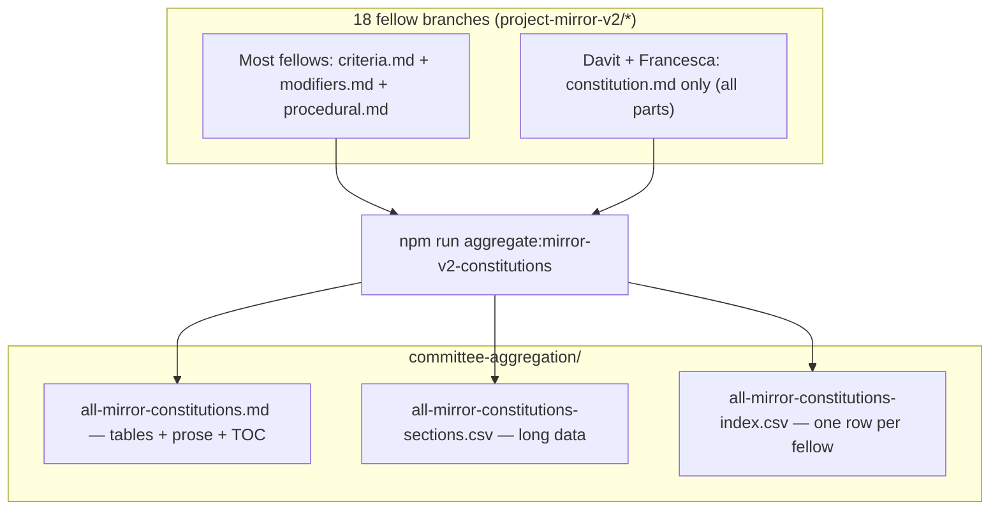

## Project Mirror v2 — aggregate constitutions for review

### Visual overview

This PR adds a **single place** to read every fellow’s evaluative rubric (Part A criteria, Part B modifiers, Part C procedural), plus **CSV exports** for analysis in Sheets, R, or pandas.

### Files

- **`all-mirror-constitutions.md`** — **Markdown tables** up front (fellow summary + one table per CSV section, with character counts and jump links), then full narrative text (TOC + per-fellow sections). Davit and Francesca use one combined `constitution.md` on their branches; everyone else uses split files when present.
- **`all-mirror-constitutions-sections.csv`** — Long format: `slug`, `section` (`part_a` | `part_b` | `part_c` | `full_constitution`), `source_file`, `content`. UTF-8 with BOM for Excel.
- **`all-mirror-constitutions-index.csv`** — One row per fellow: PR link, `layout`, character counts per part (handy for filtering without loading full text).
- **`scripts/bots/aggregate-mirror-v2-criteria.ts`** — Regenerates the three outputs; **`npm run aggregate:mirror-v2-constitutions`** from repo root (needs local `project-mirror-v2/*` refs — `git fetch origin` if missing).

The synthetic Emily input remains **rankings only** in-repo; there is no constitution text to include.

### After fellow PRs change

Re-run the npm script and commit updated artifacts (or run in CI later if you add it).
